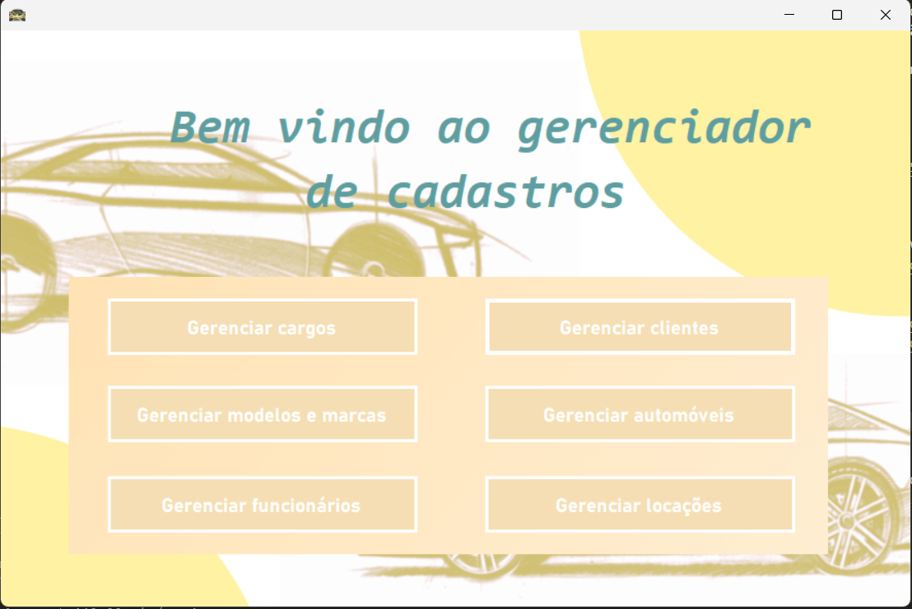
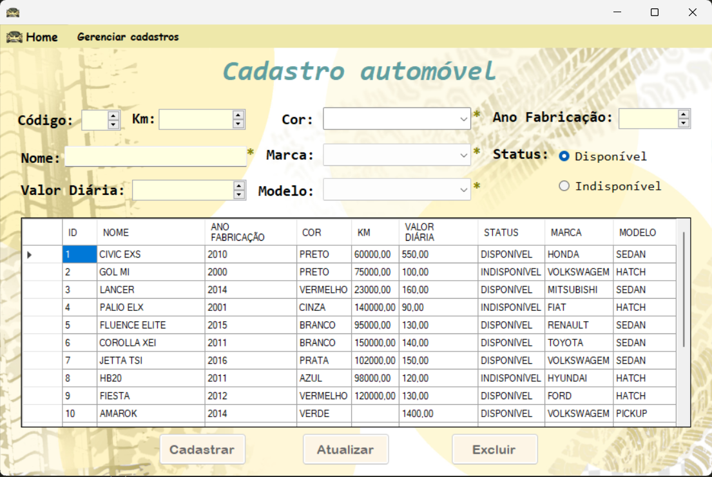
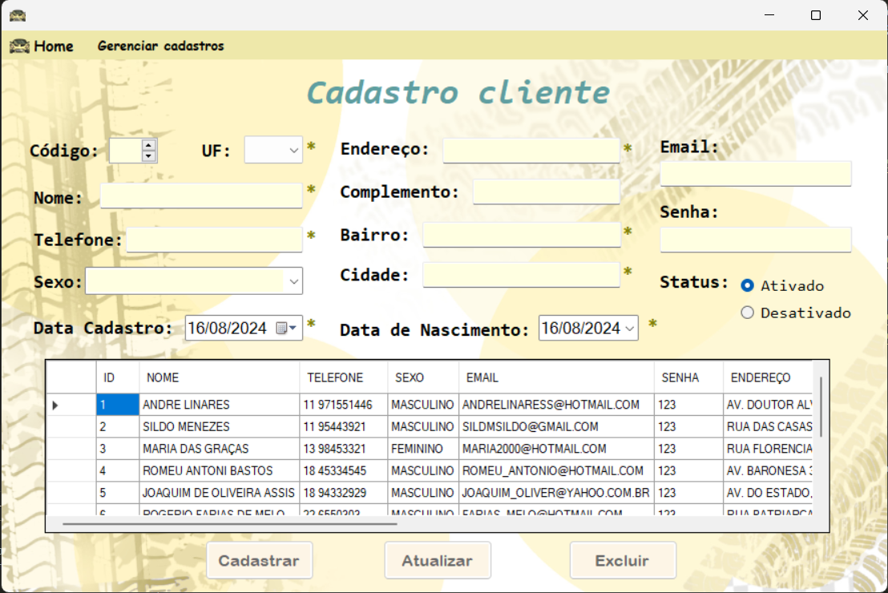

# Projeto-Locadora
Um aplicativo desktop para cadastro e gerenciamento de automóveis, clientes e funcionários para uma locadora  
O aplicativo permite o gerenciamento de cargos de funcionários, modelos e marcas de automóveis e a relação entre locação e cliente

Essa foi uma atividade desenvolvida durante o curso de Desenvolvimento de Sistemas na Etec Ermelinda Giannini Teixeira na disciplina Desenvolvimento de Sistemas em 2022

    
    
    

## ▶️ Vídeo de apresentação
Veja o [vídeo de apresentação](https://www.linkedin.com/posts/renan-mochizuki-55314a259_v%C3%ADdeo-de-apresenta%C3%A7%C3%A3o-de-um-projeto-desenvolvido-activity-7007151009097519104-kzhr) no Linkedin

## 💻 Baixe o aplicativo desktop 
Para instalar e testar o aplicativo Projeto Locadora, baixe o `Setup Aplicativo.zip` desse repositório. Você pode baixá-lo por esse link: [Setup Aplicativo](https://downgit.github.io/#/home?url=https://github.com/Renan-Mochizuki/Projeto-Locadora/tree/main/SetupLocadora)

Você também precisará do banco local, para isso, você precisa ter o [MySQLWorkbench](https://dev.mysql.com/downloads/workbench/) e rodar o script disponível na pasta `Scripts SQL` [aqui](https://github.com/Renan-Mochizuki/Projeto-Locadora/blob/main/Scrits%20SQL/locadora_2dsiem_2022.sql)  
O host e a password do banco de dados estão definidas com `root`, `root`

Com o banco de dados devidamente criado, o usuário e senha padrão do aplicativo é **admin**, **123** 

## 🛠️ Ferramentas e tecnologias
O aplicativo foi programado em **C#** utilizando o Visual Studio e foi integrado com um banco de dados local utilizando **MySQL**

## 🎓 Créditos
Esse projeto não possui nenhuma licença ou direito autoral, o projeto foi pensado e orientado como uma atividade pelo professor André Linares e a programação desse projeto foi feita pelos integrantes [Renan Mochizuki](https://github.com/Renan-Mochizuki), [Sandy Cavalcanti](https://github.com/sandycavalcanti) e [Vitor Gomes de Souza](https://www.linkedin.com/in/vitor-hugo-gomes-0ab1b325a/)